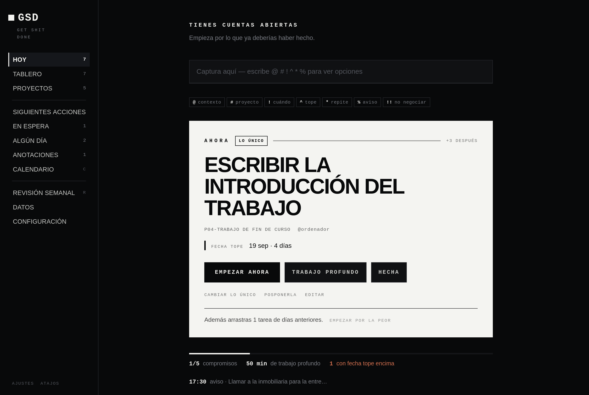
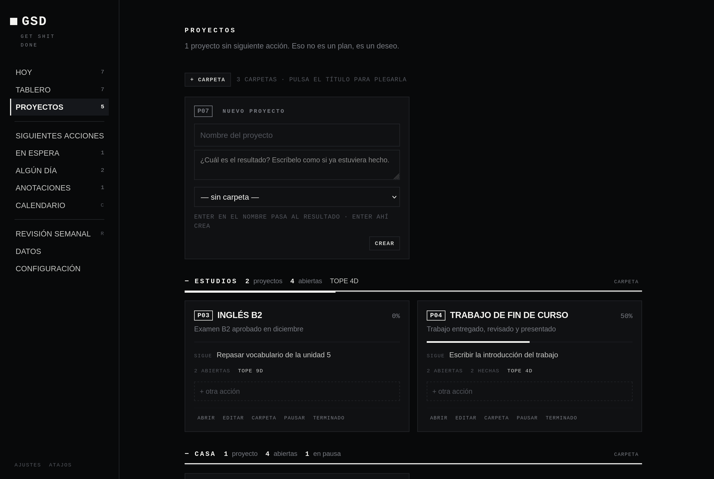
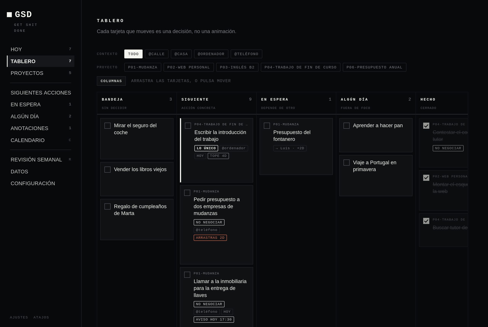
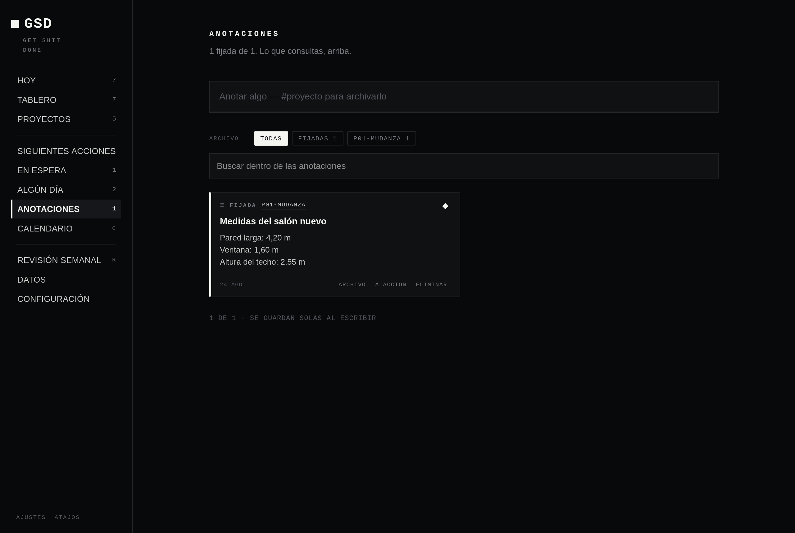
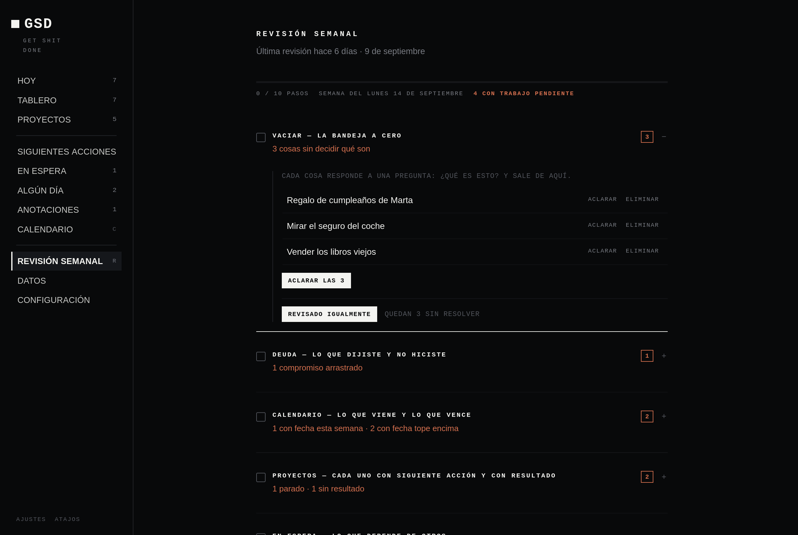

# GSD — Get Shit Done

**Stop thinking. Start doing.**

GSD es una aplicación para organizar tus tareas **y, sobre todo, para hacerlas**. Te ayuda a
sacar de la cabeza todo lo pendiente, decidir qué es cada cosa, elegir la única que importa hoy
y ponerte con ella sin distracciones.

- 💻 **Windows y Linux.**
- 🔒 **Tus datos no salen de tu ordenador.** Sin cuentas, sin nube, sin anuncios, sin seguimiento.
- ✈️ **Funciona sin internet.** Se usa desde el navegador, pero no es una web: todo ocurre en tu equipo.
- 🆓 **Gratis y de código abierto** (licencia MIT).

> **English:** GSD is a local-first task manager built on *Getting Things Done*, *Deep Work* and
> *The One Thing*. It runs on your own computer (Windows or Linux), works offline and needs no
> account. The interface is in Spanish.



---

## Índice

1. [Qué hace, en un minuto](#qué-hace-en-un-minuto)
2. [Instalación en Windows](#instalación-en-windows)
3. [Instalación en Linux](#instalación-en-linux)
4. [Abrir, cerrar y acceso directo](#abrir-cerrar-y-acceso-directo)
5. [Primeros pasos: 5 minutos](#primeros-pasos-5-minutos)
6. [Las palabras que usa la aplicación](#las-palabras-que-usa-la-aplicación)
7. [Guía de las pantallas](#guía-de-las-pantallas)
8. [Escribir rápido](#escribir-rápido)
9. [Atajos de teclado](#atajos-de-teclado)
10. [Tus datos](#tus-datos)
11. [Actualizar a una versión nueva](#actualizar-a-una-versión-nueva)
12. [Problemas frecuentes](#problemas-frecuentes)
13. [Para programadores](#para-programadores)
14. [Por qué funciona así](#por-qué-funciona-así)

---

## Qué hace, en un minuto

GSD sigue un método muy conocido, **GTD** (*Getting Things Done*), con cinco pasos:

| Paso | Qué haces | Dónde |
|---|---|---|
| **1. Capturar** | Escribes todo lo que tienes pendiente, sin pensar. | Barra de arriba en **HOY**, o tecla `N` |
| **2. Aclarar** | Decides qué es cada cosa: ¿hay que hacerla?, ¿cuándo?, ¿es de otro? | Botón **ACLARAR** |
| **3. Organizar** | Cada cosa va a su sitio: proyectos, fechas, en espera, algún día… | **PROYECTOS**, **TABLERO** |
| **4. Hacer** | Eliges *una* cosa y te pones con ella, sin distracciones. | Bloque **AHORA** en **HOY** |
| **5. Revisar** | Una vez a la semana repasas todo para que nada se pierda. | **REVISIÓN SEMANAL** |

Y le añade tres ideas: elegir **una sola cosa importante** al día (*The One Thing*), proteger
**bloques de concentración** (*Deep Work*) y un poco de **disciplina**: la aplicación te pone
difícil aplazar lo que dijiste que harías.

---

## Instalación en Windows

Funciona en **Windows 10 y 11**. No hace falta saber programar.

**1. Instala Node.js** (es gratis; GSD lo necesita para funcionar).
Entra en **https://nodejs.org**, descarga la versión que pone **LTS** e instálala dejando todas
las opciones como vienen: *Siguiente, Siguiente, Instalar*.

**2. Descarga GSD.**
En esta página, pulsa el botón verde **`<> Code`** y después **Download ZIP**.
Busca el ZIP en *Descargas*, haz clic derecho → **Extraer todo** y elige una carpeta, por ejemplo
`Documentos`.

> ⚠️ **No lo pongas en `Archivos de programa`**: ahí Windows no deja guardar datos.

**3. Ábrela.**
Entra en la carpeta y haz doble clic en **`GSD.cmd`**. Verás una ventana negra un momento y
después se abrirá tu navegador con la aplicación.

**4. Crea el acceso directo (recomendado).**
Doble clic en **`Crear acceso directo.cmd`**. GSD aparecerá en el **escritorio** y en el
**menú Inicio**, con su icono. A partir de ahí, ábrela desde ahí como cualquier programa.

> **¿Windows te avisa al abrirlo?** («Windows protegió su PC», o «¿Desea ejecutar este archivo?»)
> Pasa con cualquier archivo descargado de internet que no viene de una tienda. Pulsa
> **Más información → Ejecutar de todas formas**, o **Ejecutar**. Al crear el acceso directo,
> GSD le quita esa marca a sus archivos y el aviso no vuelve a salir.

---

## Instalación en Linux

**1. Instala Node.js 18 o superior.**

```bash
node --version        # si ya lo tienes y es v18 o más, salta al paso 2
```

| Distribución | Orden |
|---|---|
| Ubuntu 24.04+, Debian 12+ | `sudo apt install nodejs` |
| Fedora | `sudo dnf install nodejs` |
| Arch, Manjaro | `sudo pacman -S nodejs` |
| Otras, o una versión antigua | descárgalo de https://nodejs.org |

**2. Descarga GSD.**

```bash
git clone https://github.com/Tomasito25/Get-Shit-Done.git
cd Get-Shit-Done
```

Sin `git`: botón verde **`<> Code` → Download ZIP**, descomprímelo y abre una terminal dentro de
la carpeta.

**3. Ábrela.**

```bash
./start.sh
```

**4. Pon el icono en el menú y en el escritorio (recomendado).**

```bash
./start.sh install
```

> Si dice *Permiso denegado*, usa `bash start.sh` (algunos descompresores quitan el permiso de
> ejecución).

---

## Abrir, cerrar y acceso directo

GSD funciona con un pequeño programa que se queda **en segundo plano** en tu ordenador. Por eso:

- **Cerrar la pestaña del navegador no apaga nada.** Tus avisos siguen llegando.
- Para volver a entrar, abre GSD otra vez (o ve a **http://127.0.0.1:8790**).
- **No hace falta apagarlo nunca**: gasta muy poco. Al reiniciar el ordenador se apaga solo, y
  vuelve a encenderse cuando abres GSD.

| Quiero… | Windows | Linux |
|---|---|---|
| **Abrir GSD** | doble clic en el acceso directo o en `GSD.cmd` | el icono, o `./start.sh` |
| **Crear el acceso directo** | doble clic en `Crear acceso directo.cmd` | `./start.sh install` |
| **Quitar el acceso directo** | `GSD.cmd uninstall` | `./start.sh uninstall` |
| **Apagar el programa** | `GSD.cmd stop` | `./start.sh stop` |
| **Saber si está encendido** | `GSD.cmd status` | `./start.sh status` |

> **Cómo escribir órdenes en Windows:** abre la carpeta de GSD, haz clic en la barra de
> direcciones del Explorador (donde pone la ruta), escribe `cmd` y pulsa **Enter**. Se abre una
> ventana en esa carpeta: ahí escribes, por ejemplo, `GSD.cmd stop`.

Apagar o quitar el acceso directo **nunca borra tus datos**.

---

## Primeros pasos: 5 minutos

**1. Vacía la cabeza.** En **HOY**, escribe en la barra de arriba todo lo que tengas pendiente,
una cosa cada vez, y pulsa **Enter**. No lo ordenes ni lo pienses: solo escríbelo. Lo que
escribes así va a la **bandeja**.

**2. Aclara la bandeja.** Pulsa **ACLARAR**. GSD te enseña cada cosa y te pregunta: *¿qué es
esto?* Si se hace en menos de dos minutos, **hazla ya** (tecla `0`). Si no, decide:

| Tecla | Opción | Cuándo |
|---|---|---|
| `1` | Eliminar | No importa. Fuera. |
| `2` | Anotar | Es información que quieres guardar, no algo que hacer. |
| `3` | Algún día | Te interesa, pero no ahora. |
| `4` | Delegar | Lo tiene que hacer otra persona. |
| `5` | Programar | Tiene un día concreto. |
| `6` | Siguiente acción | Hay que hacerlo en cuanto puedas. |

Antes de decidir, reescríbelo como algo que se pueda **hacer**: no «Física», sino «Resolver los
ejercicios 4 a 8 del tema de campos».

**3. Elige lo único.** Pregúntate: *de todo esto, ¿qué es lo que, si lo hago, hace que lo demás
sea más fácil o innecesario?* Márcalo como **LO ÚNICO**. Solo puede haber uno.

**4. Empieza.** Vuelve a **HOY**: arriba, en grande, verás lo que toca **AHORA**. Pulsa
**EMPEZAR AHORA** y la aplicación desaparece: solo queda tu tarea.

**5. Una vez a la semana, revisa.** Entra en **REVISIÓN SEMANAL** y sigue los diez pasos. Te
llevan por todo lo que tienes para que nada se quede olvidado.

---

## Las palabras que usa la aplicación

| Palabra | Qué significa |
|---|---|
| **Bandeja** | Lo que has apuntado y aún no has decidido qué es. |
| **Siguiente acción** | Lo próximo que se puede hacer, físico y concreto: «llamar a Ana», no «el viaje». |
| **Lo único** | La tarea más importante del día. Solo hay una. |
| **Compromiso** o **No negociar** | Algo que has decidido hacer hoy sí o sí. Si pasas de 5 en un día, la aplicación te frena (el límite se puede cambiar). |
| **Lo que arrastras** | Compromisos de días anteriores que siguen sin hacer. |
| **Proyecto** | Un objetivo que necesita varias acciones. Tiene un código (`P01`, `P02`…) y un **resultado**: cómo sabrás que está terminado. |
| **Carpeta** | Agrupa proyectos por área de tu vida: estudios, trabajo, casa. |
| **Contexto** | Dónde o con qué puedes hacer algo: `@casa`, `@ordenador`, `@calle`. |
| **En espera** | Lo que depende de otra persona, con una fecha para preguntar cómo va. |
| **Algún día** | Ideas que no son para ahora. |
| **Anotación** | Información que quieres guardar y consultar: medidas, datos, ideas. No es una tarea. |
| **Cuándo lo haces** | El día en que piensas ponerte. |
| **Fecha tope** | El último día en que sirve hacerlo. No es lo mismo que *cuándo lo haces*. |
| **Aviso** | Una notificación en tu escritorio, a la hora que elijas. |
| **Enfoque** | Pantalla completa con una sola tarea, sin nada más. |
| **Trabajo profundo** | Un bloque de tiempo largo y protegido para concentrarte. |

---

## Guía de las pantallas

### HOY — qué hago ahora

Es lo primero que ves. De arriba abajo:

1. **Barra de captura.** Para apuntar algo al vuelo.
2. **AHORA.** Una sola tarea, en grande, con el botón para empezar. GSD la elige siempre en este
   orden: **lo único** → **lo que arrastras** de otros días → **tus compromisos** → **lo que vence hoy**.
   Si no hay nada decidido, te pide que elijas.
3. **El día.** Una línea con cuántos compromisos llevas cumplidos y cuánto trabajo profundo has hecho.
4. **Después.** El resto de tareas de hoy, numeradas.
5. **Vence pronto** y **Bandeja.** Lo que tiene la fecha tope encima y lo que falta por decidir.
6. **El resto del sistema**, plegado: en espera, lo que queda para otros días y tus anotaciones fijadas.

### PROYECTOS — tus objetivos



- **Crear un proyecto:** la primera tarjeta. Escribe el nombre, **Enter**, el resultado, **Enter**.
  El código (`P07`) lo pone la aplicación.
- **Cada tarjeta** muestra el avance, la siguiente acción y la fecha tope más cercana. Si un
  proyecto no tiene siguiente acción, sale en rojo, con un campo para escribirla ahí mismo.
- **Carpetas:** botón **+ CARPETA**. Pulsa el título de una carpeta para plegarla. Para meter un
  proyecto en una carpeta: botón **CARPETA** de su tarjeta.
- **Pausar:** botón **PAUSAR**. El proyecto desaparece de HOY y del tablero hasta la fecha que
  elijas (1 semana, 2, un mes, o sin fecha). No se borra nada. Una carpeta entera también se
  puede pausar.
- **Abrir** un proyecto muestra su propio tablero y sus anotaciones.

### TABLERO — todo el trabajo de un vistazo



Columnas: **Bandeja · Siguiente · En espera · Algún día · Hecho**.

- Marca la **casilla** de una tarjeta para completarla.
- Para cambiarla de columna, **arrástrala**, o pulsa **MOVER** y elige.
- Filtra por **contexto** o salta a un **proyecto** con los botones de arriba.
- Botón **COLUMNAS**: cambiar nombres, orden, ocultar alguna o poner un máximo de tarjetas.
- **Hecho** solo guarda lo terminado en los últimos 7 días.

### ANOTACIONES — información, no tareas



Para guardar datos que quieres consultar: medidas, direcciones, ideas, enlaces. Se escriben directamente en la tarjeta y **se guardan solas**. Escribe `#P01` en la
línea para guardarla dentro de un proyecto. Pulsa **◇** para **fijarla**: sale la primera y
aparece en HOY. Si resulta que era una tarea, **A ACCIÓN** la convierte.

### REVISIÓN SEMANAL — que nada se pierda



Diez pasos. Cada uno se abre, te enseña lo que hay que decidir y **lo resuelves ahí mismo**, sin ir
a otra pantalla:

**Vaciar** la bandeja · **Deuda** (lo que no hiciste) · **Calendario** · **Proyectos** sin
siguiente acción o sin resultado · **En espera** · **Acciones** que llevan semanas quietas ·
**Algún día** · **Anotaciones** · **Crónicas** (lo que aplazas una y otra vez) · **La semana**
(elegir lo único).

En rojo, lo que queda sin resolver. Al terminar, verás tu marcador: qué porcentaje de lo que
dijiste que harías has hecho de verdad.

### Las demás

| Pantalla | Para qué sirve |
|---|---|
| **SIGUIENTES ACCIONES** | Lista de todo lo que se puede hacer ya, filtrable por contexto. |
| **EN ESPERA** | Lo que depende de otros, agrupado por persona. **+7D** retrasa la revisión una semana. |
| **ALGÚN DÍA** | Ideas aparcadas. **ACTIVAR** las devuelve a la lista de trabajo. |
| **CALENDARIO** | Mes a mes: lo que tiene fecha y los avisos de cada día. |
| **DATOS** | Dónde están tus datos, copias de seguridad, exportar e importar. |
| **CONFIGURACIÓN** | Contextos, carpetas, columnas, límite de compromisos al día y tema claro u oscuro. |

### Dentro de una tarea

Haz clic en cualquier tarea para abrirla. **No hay botón de guardar: todo se guarda solo.**

- **Fechas en un toque:** bajo cada fecha hay botones como **HOY · MAÑANA · +2D · +1 SEM**.
- **Aviso:** botones rápidos como **EN 1 H** o **MAÑANA 9:00**. Llega como notificación del
  escritorio aunque el navegador esté cerrado, siempre que GSD esté encendido.
- **Se repite:** `diario`, `3d` (cada 3 días), `lun,mie,vie`, `mes-1` (el día 1 de cada mes). La
  siguiente aparece cuando completas la actual: nunca se acumulan copias.
- **No negociar** y **Lo único:** casillas para comprometerte.

### Enfoque y trabajo profundo

- **ENFOQUE** (tecla `F`): pantalla completa con una tarea. Temporizador de 25, 50 o 90 minutos, o sin límite.
- **TRABAJO PROFUNDO** (tecla `D`): antes de empezar eliges cuánto dura (60, 90, 120 minutos o
  sin límite) y escribes qué significa haber terminado. Mientras dura, `Esc` no te saca: para
  abandonar hay que mantener pulsado el botón. Al acabar, se apuntan los minutos.

---

## Escribir rápido

Puedes añadir los detalles **en la misma línea** en la que apuntas algo. No hace falta
memorizarlo: al escribir aparece la lista de opciones debajo, y `↑` `↓` + `Enter` eligen.

```
Comprar cajas @calle !mañana
Enviar el borrador #P04 ^20/09 %mañana-9
Sacar la basura *lun,mie,vie
Llamar al banco !! %17:30
```

| Escribe | Para | Ejemplos |
|---|---|---|
| `@` | contexto | `@casa` `@ordenador` `@calle` |
| `#` | proyecto (por código o nombre; si no existe, lo crea) | `#P04` `#mudanza` |
| `!` | cuándo lo haces | `!hoy` `!mañana` `!lun` `!+3d` `!12/09` |
| `^` | fecha tope | `^20/09` `^+10d` |
| `%` | aviso | `%18:00` `%9` `%mañana-9` `%lun-18:30` |
| `*` | repetición | `*diario` `*3d` `*lun,jue` `*mes-1` |
| `!!` | compromiso de hoy (no negociar) | |

Lo que la aplicación no entiende se queda en el título: nunca se pierde texto. Si escribes una
línea **sin** ninguna marca, va a la bandeja para decidirla después; **con** marcas, ya está decidida.

---

## Atajos de teclado

Toda la aplicación se puede usar sin ratón. Pulsa `?` dentro de GSD para verlos.

| Tecla | Hace | | Tecla | Hace |
|---|---|---|---|---|
| `N` | Apuntar algo nuevo | | `↑` `↓` o `J` `K` | Moverse por la lista |
| `T` | Ir a HOY | | `Espacio` | Completar la tarea marcada |
| `B` | Tablero | | `Enter` | Abrir |
| `P` | Proyectos | | `Esc` | Cerrar / salir |
| `I` | Aclarar la bandeja | | `/` o `Ctrl` `K` | Buscar |
| `F` | Enfoque | | `\` | Plegar la barra lateral |
| `D` | Trabajo profundo | | `0`–`6` | Opciones al aclarar |
| `O` | Elegir lo único | | `W` | En espera |
| `S` | Algún día | | `A` | Anotaciones |
| `C` | Calendario | | `R` | Revisión semanal |

---

## Tus datos

**Se guardan solos, en tu ordenador.** No hay que pulsar nada.

- **Dónde:** en la carpeta **`data`**, dentro de la carpeta de GSD. La ruta exacta aparece en la
  pantalla **DATOS**.
- **Doble seguridad:** se guardan en el navegador y, además, en un archivo en disco tras cada cambio.
- **Copias automáticas:** una copia por día (se guardan las últimas 30) y la versión anterior a
  cada cambio. Si alguna vez algo sale mal, en **DATOS** puedes **recuperar** cualquiera.
- **Exportar:** en **DATOS**, botones **JSON** (copia completa) y **CSV** (para abrir en Excel).
- **Llevártelo a otro ordenador:** copia la carpeta `data` a la carpeta de GSD del otro equipo.

### ¿Se suben mis tareas a GitHub?

**No.** La carpeta `data` está excluida del repositorio (archivo `.gitignore`): ni se sube ni se
descarga. Si haces una copia de este proyecto y subes cambios, tus tareas se quedan en tu ordenador.

### ¿Alguien puede ver mis tareas?

No. GSD solo escucha en tu propio ordenador (`127.0.0.1`): ni internet ni otros equipos de tu red
pueden entrar. No hay cuentas, ni telemetría, ni conexiones a ningún servidor.

---

## Actualizar a una versión nueva

**Si lo descargaste con `git`:**

```bash
git pull
```

**Si lo descargaste en ZIP:**

1. Apaga GSD: `GSD.cmd stop` (Windows) o `./start.sh stop` (Linux).
2. Descarga y descomprime la versión nueva en una carpeta nueva.
3. **Copia la carpeta `data` de la versión vieja dentro de la nueva.** Ahí están tus tareas.
4. Abre la nueva. Si usabas acceso directo, créalo otra vez desde la carpeta nueva.

---

## Problemas frecuentes

**«No encuentro Node.js»**
Instálalo desde https://nodejs.org (versión LTS). Si acabas de instalarlo y sigue saliendo,
reinicia el ordenador.

**El navegador dice «No se puede acceder a este sitio»**
El programa está apagado. Abre GSD otra vez desde el acceso directo, `GSD.cmd` o `./start.sh`.

**La página se queda en blanco, o dice que no puede abrir el almacén**
Tienes GSD abierta en otra pestaña o ventana. Ciérralas todas menos una y recarga (`F5`).

**No me llegan los avisos**
- Solo llegan con GSD encendido (no hace falta tener el navegador abierto).
- **Windows:** los avisos aparecen con el nombre **Windows PowerShell**. Revisa
  *Configuración → Sistema → Notificaciones* y que no esté activado *No molestar*.
- **Linux:** hace falta `notify-send` (paquete `libnotify-bin` en Ubuntu y Debian).
- Si el sistema no los permite, GSD avisa dentro de la propia página mientras está abierta.

**«El puerto 8790 está ocupado»** (otro programa lo usa)
Usa otro. En Windows, dentro de la ventana de `cmd`:
```
set PORT=8800
GSD.cmd
```
En Linux: `PORT=8800 ./start.sh`. La primera vez con un puerto nuevo, GSD recupera tus datos
del disco automáticamente.

**Windows avisa cada vez que lo abro**
Haz doble clic en `Crear acceso directo.cmd`: quita la marca de «descargado de internet».

**Quiero borrar GSD del todo**
Exporta antes tus datos si los quieres (**DATOS → JSON**). Luego apágalo, quita el acceso
directo (`GSD.cmd uninstall` o `./start.sh uninstall`) y borra la carpeta.

---

## Para programadores

### Cómo está hecho

- **Cero dependencias.** Servidor en Node con módulos nativos y JavaScript sin frameworks en el
  navegador. Sin `npm install`, sin `node_modules`, sin compilar: se edita y se recarga.
- **Dos capas de datos.** IndexedDB en el navegador es la fuente de verdad; el servidor guarda
  una copia en disco con escritura atómica, versión anterior, copia diaria y una copia de
  seguridad aparte si alguna vez llega un estado vacío habiendo datos.
- **Avisos del sistema** lanzados por el servidor: `notify-send` en Linux, notificaciones
  nativas vía Windows PowerShell en Windows.

### Estructura

```
GSD.cmd                    Windows: doble clic para arrancar
Crear acceso directo.cmd   Windows: acceso directo en escritorio y menú Inicio
start.ps1                  Windows: arrancar, parar, estado, instalar
start.sh                   Linux: lo mismo
server.js                  Servidor local (127.0.0.1): estáticos, copia en disco, avisos
public/
  index.html · manifest.webmanifest · icon.svg · icon.ico
  css/app.css
  js/
    app.js          Rutas, navegación y teclado
    store.js        Estado y reglas del sistema
    db.js           IndexedDB
    sync.js         Copia en disco
    components.js   Editor, captura, filas, capas, fricción
    parse.js        Sintaxis de captura: @ # ! ^ * % !!
    assist.js       Ayuda de la sintaxis mientras se escribe
    voice.js        Las frases, deducidas del estado
    focus.js        Enfoque y trabajo profundo
    search.js       Búsqueda
    views/          Una por pantalla
dev/
  check.mjs       Sintaxis y formato de todo el proyecto
  smoke.mjs       Prueba del servidor con datos temporales
  launcher.mjs    Prueba del arrancador del sistema en el que se ejecuta
docs/             Capturas de este README
data/             Tus datos. Fuera del repositorio.
```

### Pruebas

```bash
node dev/check.mjs      # sintaxis de los módulos, del servidor y de los arrancadores
node dev/smoke.mjs      # arranca el servidor en una carpeta temporal y lo pone a prueba
node dev/launcher.mjs   # arranca, instala, para y comprueba con el arrancador del sistema
```

Ninguna toca tus datos. GitHub Actions las ejecuta en **Linux y Windows**, con **Node 18 y 22**,
en cada cambio.

### Variables de entorno

| Variable | Para qué | Por defecto |
|---|---|---|
| `PORT` | Puerto del servidor | `8790` |
| `GSD_DATA_DIR` | Carpeta de los datos | `data/` junto a la aplicación |
| `GSD_BROWSER` | Navegador concreto con el que abrir | el del sistema |
| `GSD_NO_BROWSER` | Si tiene valor, no abre el navegador | — |

### Modelo de datos

```
Task      id · title · status · projectId · context · dueDate · deadline · reminder · waitingFor
          notes · createdAt · completedAt · completed · isOneThing · isCommitment
          postponeCount · recurrence · pinned
Project   id · code · name · outcome · folderId · status · pausedUntil · createdAt
Folder    id · name · createdAt                      (guardadas en los ajustes)
Waiting   id · taskId · person · description · reviewDate
Session   id · taskId · kind · plannedMin · startedAt · endedAt · minutes · note
```

`status`: `inbox` · `next` · `scheduled` · `waiting` · `someday` · `reference` (anotación) · `done`

### La regla

Antes de añadir cualquier función: *¿ayuda directamente a capturar, aclarar, organizar, revisar
o ejecutar? ¿O solo le da al usuario otra cosa que hacer dentro de la aplicación?* Si genera
trabajo administrativo, no entra.

---

## Por qué funciona así

**Aplazar cuesta.** Las tareas marcadas como compromiso no se posponen con un clic: hay que
**mantener pulsado** el botón, y cuanto más has huido de una tarea, más tiempo. No es un
castigo: es que renegociar contigo mismo no salga gratis.

**La aplicación es honesta.** Te enseña lo que arrastras de otros días. Si terminas tres tareas
fáciles y la importante sigue sin tocar, te lo dice. A la tercera vez que aplazas algo, deja de
pedirte otra fecha y te pide una decisión: hacerlo, delegarlo, programarlo de verdad o borrarlo.

**Sin premios.** Nada de puntos, medallas, rachas ni celebraciones. Lo único que mide es qué
parte de lo que dijiste que harías has hecho, y cuántas horas de trabajo profundo llevas.

**Pocas cosas a la vez.** Una sola tarea en *lo único*, un máximo de compromisos al día y columnas
con límite. Tener la lista larga no es tenerlo controlado.

**El tono.** Todo está en español salvo algunas frases cortas en inglés, en la línea de David
Goggins (*Stop negotiating. Start.*). Ninguna frase es aleatoria: dependen de lo que estás
haciendo o dejando de hacer. Y detrás de todas, una idea: **si cuesta, es que estás aprendiendo.**

---

## Licencia

[MIT](LICENSE) © 2026 Tomas. Úsalo, cámbialo y compártelo como quieras.
